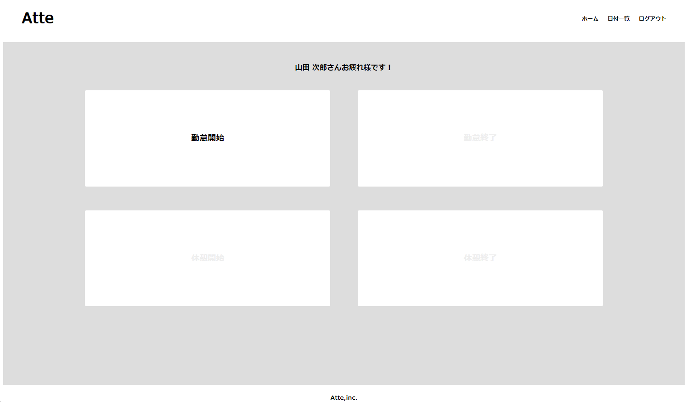

# Atte
 勤怠管理システム  
 -勤怠情報を打刻しそれを確認することができるシステム  

## 作成した目的
 課題のため

## 他のリポジトリ

## 機能一覧
 ・打刻機能   
  「勤怠開始」「勤怠終了」「休憩開始」「休憩終了」の情報を記録する   
 ・勤怠情報確認機能   
   日付別に勤怠情報を確認する   
 ・ログイン機能（メール認証有）   

## テーブル設計

## ER図

## 環境構築
npmの実装が必要　実行コマンド：npm　run dev
